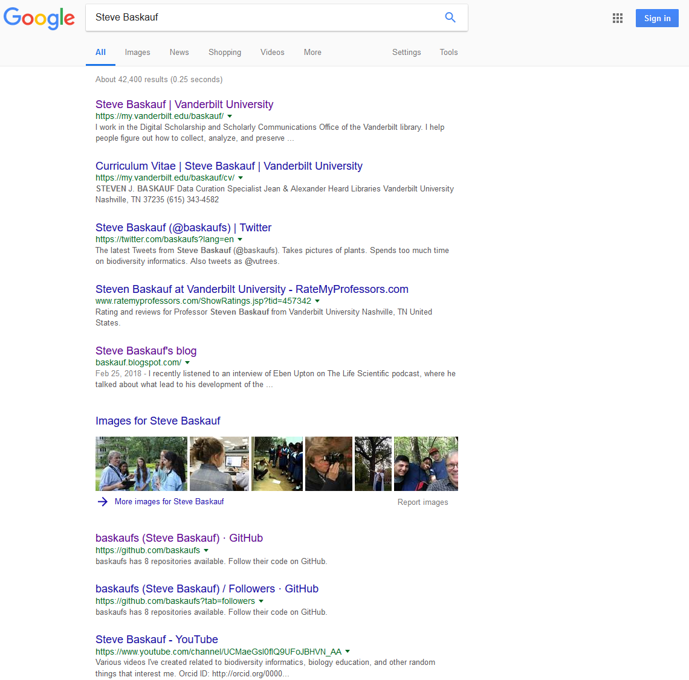

# Attempts to provide structured data to Google  2018-09-25

## Structured data for a blog post

### schema.org JSON-LD for the blog post

To create structured data for [a blog post](http://baskauf.blogspot.com/2017/07/how-and-why-we-set-up-sparql-endpoint.html), I used the [Structured Data Testing Tool](https://search.google.com/structured-data/testing-tool), entered from the [Article Feature Guide](https://developers.google.com/search/docs/data-types/article) by the "See Markup" button.  I hacked the existing code to this:

```
<script type="application/ld+json">
{
  "@context": "http://schema.org",
  "@type": "BlogPosting",
  "mainEntityOfPage": {
    "@type": "WebPage",
    "@id": "http://baskauf.blogspot.com/2017/07/how-and-why-we-set-up-sparql-endpoint.html"
  },
  "headline": "How (and why) we set up a SPARQL endpoint",
  "image": {
    "@type": "ImageObject",
    "url": "https://2.bp.blogspot.com/--QLRvc44Ojk/WVlchjm06yI/AAAAAAAABek/bjWUfZ6HSYklqIYgYf21qEjTJtSLhwCowCLcBGAs/s640/application.png",
    "height": 640,
    "width": 524
  },
  "datePublished": "2017-07-02T15:11:00-07:00",
  "dateModified": "2017-07-02T15:11:00-07:00",
  "author": {
    "@type": "Person",
    "name": "Steve Baskauf",
    "@id":"https://orcid.org/0000-0003-4365-3135",
    "sameAs": "http://bioimages.vanderbilt.edu/contact/baskauf"
  },
  "publisher": {
    "@type": "Organization",
    "name": "Baskauf personal blog",
    "logo": {
      "@type": "ImageObject",
      "url": "https://scontent-atl3-1.cdninstagram.com/vp/94f43ab4c94ca56c3d74f3d275fb7670/5C2E73A3/t51.2885-19/s150x150/13774778_1753029844967575_204181086_a.jpg",
      "width": 60,
      "height": 60
    }
  },
  "description": "This article describes the reasons why a working group at Vanderbilt University wanted to set up a SPARQL endpoint and provides the technical details necessary to do so."
}
</script>
```

Here are some notes:

1. I got the image URL for the post by right-clicking on the featured image, opening it in a new tab, then copying the URL.  I got the height and width (on a Mac) by downloading the image, right clicking on it in Finder, and selecting "Get Info".
2. I got the datePublished from the blog editing screen and used the same date for dateModified.  
3. I wanted Google to know who I was, so I added the @id key:value pair for my ORCID ID.
4. I also added a "sameAs" property to my contact page on Bioimages because I am going to describe my self there using structured data.
5. The publisher field would not allow the publisher to be a Person. So I made up an organization name.  It required a logo, so I found one that I used on Instagram and got its URL as I did for the featured image.
6. The testing tool complained when the logo width and height were 150x150 pixels, so I said they sere 60x60 (apparently the maximum allowed height), even though that's wrong.  Probably I should find a smaller logo.

### Inserting the JSON-LD into the blog post (Blogger platform)

To get the JSON-LD into the post, I edited the post.  Then I clicked on the HTML tab to switch from the WYSIWYG editor to HTML editing.  The editor just shows the body - I think it generates the head section later.  I pasted the JSON-LD (including the script container element) at the top of the editing screen.  It looked like this:


I saved the edited version, reloade the log page, then viewed the page source.  After scrolling about 600 lines down, into the body section, I found the JSON-LD: 


That's good - Blogger didn't strip out the script tag!

Then I went to the [Google Structured Data Testion Tool](https://search.google.com/structured-data/testing-tool), entered the blog URL into the "Fetch URL" box, then clicked "Run test":


There were two sources of structured data.  The data provided by Blogger itself had 7 errors and 4 warnings.  My structured JSON-LD had 0 errors and 0 warnings (yea!).  Hopefully the bad structured data provided by Blogger won't cause me to be dinged by Google.

### Test to see if search results for the post improve

In order to find out if the structured data helps, I wanted to get before and after Google search results.  So I googled "setting up a SPARQL endpoint".  Surprisingly, my blog post was the first hit, even on browsers where I wasn't logged in to Google and it didn't know my search history.  So I guess this isn't a good test to improve the search rank.  Here's what the results looked like:


If it changes to something better, I'll add another screenshot later.

## Structured data for a person

It is not clear to me how Google creates its data records for people.  They clearly have structured data boxes for people, however, they don't have a "feature guide" for people.  So where does that structured data come from? I'm not sure.

### schema.org JSON-LD about me

I got some ideas by rummaging around on the web and came up with the following JSON-LD:  

```
<script type="application/ld+json">
{
  "@context": "https://schema.org/",
  "@id": "https://orcid.org/0000-0003-4365-3135",
  "@type": "Person",
  "name": [
      "Steven J. Baskauf",
      "Steve Baskauf",
      "Steven James Baskauf"
    ],
  "familyName": "Baskauf",
  "givenName": [
      "Steve",
      "Steven"
    ],
  "email": "steve.baskauf@vanderbilt.edu",
  "url": "https://my.vanderbilt.edu/baskauf/",
  "mainEntityOfPage": {
    "@type": "WebPage",
    "@id": "https://my.vanderbilt.edu/baskauf/"
    },
  "worksFor": {
      "name": "Vanderbilt University",
      "@id": "https://www.grid.ac/institutes/grid.152326.1",
      "@type": "Organization"
    },
  "image": "https://avatars3.githubusercontent.com/u/5765781?s=400&u=ce07e6c5611a3f4d0abb82593736e2c4eb56b095&v=4",
  "jobTitle": "Digital Curation Specialist",
   "sameAs": [
      "http://viaf.org/viaf/63557389",
      "http://www.wikidata.org/entity/Q40670042",
      "http://bioimages.vanderbilt.edu/contact/baskauf",
      "https://twitter.com/baskaufs",
      "https://www.instagram.com/baskaufs/",
      "https://plus.google.com/+SteveBaskauf",
      "https://github.com/baskaufs/"
    ]
}
</script>
```

### Inserting the JSON-LD about me into a web page about me

Unfortunately, all of the good places on the web to put structured data about myself (for example ORCID, VIAF, my WordPress page at Vanderbilt) have HTML that is not under my control. I did have two options: a contact page on my Bioimages website (http://bioimages.vanderbilt.edu/contact/baskauf) that's on one of the Vanderbilt servers, and a contact page on my genealogy website (http://baskaufs.github.io/baskauf-contact.htm), which runs off of Github pages.  I inserted the JSON-LD into the head section, which you can see if you load either of the pages and view the page source.

I checked the pages in the [Google Structured Data Testion Tool](https://search.google.com/structured-data/testing-tool) by entering their URLs, and it had no problem loading the JSON-LD with no errors.

### Test to see if the search results for me improve

The search results for "Steve Baskauf" on 2018-09-26 aren't very interesting:



and the two pages into which I inserted the structured data don't show up very high in the results. They are higher if I search for "Steve Baskauf contact".  So I know that Google is indexing them.  We'll see if the search results look any more interesting as time goes by.