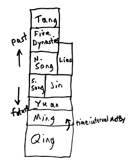
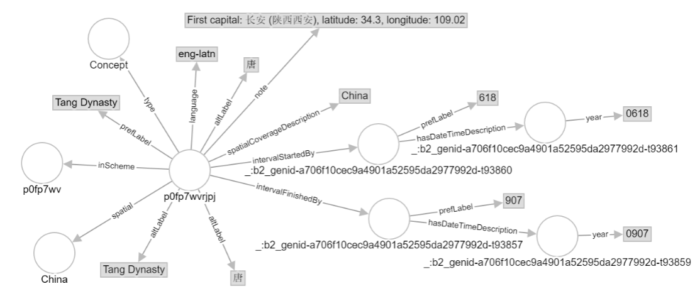
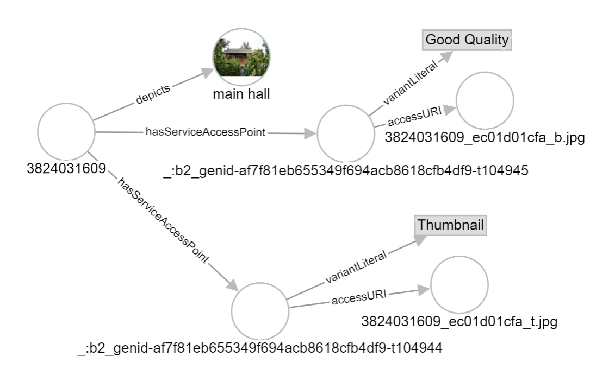

# Visualizing SPARQL results using Metaphactory 

Linked Data Working Group 2018-10-29

## Some useful specialized SPARQL commands

`concat(?siteLabel, " ", ?buildingLabel` *concatenate strings*

`BIND(concat(?siteLabel, " ", ?buildingLabel) AS ?description)` *bind a value to a variable*

`LANG(?siteLabel)` *find the language label of a literal*

`FILTER((LANG(?siteLabel)) = "en")` *filter a variable based on a condition*

`SELECT (count(distinct ?actor) as ?nActors)` *count non-redundant instances*

*count number of instances within a particular category:*
```
SELECT ?film (count(*) as ?nActors) WHERE {
  ?film <http://data.linkedmdb.org/resource/movie/actor> ?actor .
}
group by ?film
```

`STRDT(concat(str(?endYear), "-01-01"),xsd:date)` *turn a datatyped xsd:gYear into a datatyped xsd:date*

## Link to Metaphactory free trial

<https://www.metaphacts.com/trial>

## Template directions

See <https://help.metaphacts.com/resource/Help:HTML5Components> for template instructions

# Create visualizations based on Traditional Chinese Architecture

All data can be downloaded from <https://github.com/HeardLibrary/semantic-web/tree/master/2016-fall/tang-song/final-rdf>

Note: In some cases triples are available as both RDF/XML (.rdf) and RDF/Turtle (.ttl) files.  Only one needs to be loaded - they contain exactly the same information.  The temple-images-minimal files contain a subset of the triples in temple-images.rdf (which at 6.1 Mb caused trouble loading in the .small metaphactory instance; for comparison, temple-images-minimal.ttl is only 1.1 Mb).

The graph model for sites and buildings is at <https://github.com/HeardLibrary/semantic-web/blob/master/sparql/tcadrt.md>

All queries should run at the Working Group's SPARQL endpoint <https://sparql.vanderbilt.edu/> although the visualizations won't happen there.

## create a map showing the locations of buildings, labeled by site and building

page resource/:map

```
<semantic-map
  query='
PREFIX rdf: <http://www.w3.org/1999/02/22-rdf-syntax-ns#>
PREFIX rdfs: <http://www.w3.org/2000/01/rdf-schema#>
PREFIX schema: <http://schema.org/>
PREFIX geo: <http://www.w3.org/2003/01/geo/wgs84_pos#>

SELECT ?lat ?lng ?description ?link WHERE {
  ?site rdf:type schema:Place.
  ?building schema:containedInPlace ?site.
  ?building geo:lat ?lat.
  ?building geo:long ?lng.
  ?building rdfs:label ?buildingLabel.
  ?site rdfs:label ?siteLabel.
  FILTER((LANG(?buildingLabel)) = "en")
  FILTER((LANG(?siteLabel)) = "en")
  BIND(concat(?siteLabel, " ", ?buildingLabel) AS ?description)

}
ORDER BY ?siteLabel 
'
 tuple-template='<b>{{description.value}}</b><br><a href="https://wikidata.metaphacts.com/resource/?uri={{link.value}}" target="_blank">This link does not work</a>'
></semantic-map>
```

## create a graph diagram (bubble diagram)

page resource/:bubble

Start query with Baitai Monastery http://tcadrt.org/work/000002

```
<semantic-graph height="1000" query="
PREFIX schema: <http://schema.org/>
CONSTRUCT {
  ?building schema:containedInPlace <http://tcadrt.org/work/000002>
} 
WHERE {
  ?building schema:containedInPlace <http://tcadrt.org/work/000002>.
}
">
</semantic-graph>
```

Extend query to all sites that have thumbnails

```
<semantic-graph height="1000" query="
PREFIX rdf: <http://www.w3.org/1999/02/22-rdf-syntax-ns#>
PREFIX schema: <http://schema.org/>

CONSTRUCT {
  ?building schema:containedInPlace ?site.
} 
WHERE {
  ?site rdf:type schema:Place.
  ?building schema:containedInPlace ?site.
  # the semantic graph applies a thumbnail if the resource has a schema:thumbnail property
  ?picBuilding schema:containedInPlace ?site.
  ?picBuilding schema:thumbnail ?image.
}
">
</semantic-graph>
```

## create a timeline for buildings at the site Chongjiao Monastery http://tcadrt.org/work/000012

Turtle for a site record:

```Turtle
<http://tcadrt.org/work/000124> <http://purl.org/dc/terms/temporal> [<http://vocab.getty.edu/ontology#estEnd> "1125"^^xsd:gYear ; 
                                                                     <http://vocab.getty.edu/ontology#estStart> "0960"^^xsd:gYear ; 
                                                                     :hasBeginning [:inDateTime [:year "0960"^^xsd:gYear ; 
                                                                                                 a :GeneralDateTimeDescription] ; 
                                                                                    a :Instant] ; 
                                                                     :hasEnd [:inDateTime [:year "1125"^^xsd:gYear ; 
                                                                                           a :GeneralDateTimeDescription] ; 
                                                                              a :Instant] ; 
                                                                     a <http://purl.org/dc/terms/PeriodOfTime> ; 
                                                                     a :Interval ; 
                                                                     rdfs:label "960-1125"];
                                <http://rs.tdwg.org/dwc/terms/verbatimLatitude> "37˚ 25.472 (Garmin)";
                                <http://rs.tdwg.org/dwc/terms/verbatimLongitude> "112˚ 32.840";
                                <http://schema.org/containedInPlace> <http://tcadrt.org/work/000001>;
                                <http://schema.org/geo> [<http://schema.org/latitude> "37.42453333" ; 
                                                         <http://schema.org/longitude> "112.5473333" ; 
                                                         a <http://schema.org/GeoCoordinates>];
                                <http://tcadrt.org/ontology/ang-shaped_shuatou> "0";
                                <http://tcadrt.org/ontology/beveled_linggong> "0";
                                <http://tcadrt.org/ontology/cejiao> "1";
                                <http://tcadrt.org/ontology/chamfered_linggong> "1";
                                <http://tcadrt.org/ontology/corner_angled_bracket_arm> "0";
                                <http://tcadrt.org/ontology/ct_angled_bracket_arm> "0";
                                <http://tcadrt.org/ontology/first_step_jixin> "1";
                                <http://tcadrt.org/ontology/first_step_touxin> "0";
                                <http://tcadrt.org/ontology/ic_angled_bracket_arm> "0";
                                <http://tcadrt.org/ontology/ic_match_ct> "0";
                                <http://tcadrt.org/ontology/number_of_ic_in_central_bay> "1";
                                <http://tcadrt.org/ontology/number_of_xiaang> "0";
                                <http://tcadrt.org/ontology/pizhu_xiaang> "0";
                                <http://tcadrt.org/ontology/pupaifang> "1";
                                <http://tcadrt.org/ontology/qinmian-pizhu_xiaang> "0";
                                <http://tcadrt.org/ontology/qinmian_xiaang> "0";
                                a <http://schema.org/LandmarksOrHistoricalBuildings>;
                                rdfs:comment "sutra repository Song, compare to Jidumiao qingong",
                                             "ZGWWDTJ  山西 p. 762    57 – C 1  -other parts of the monastary have been destroyed";
                                rdfs:label "sutra hall"@en,
                                           "藏经殿"@zh-hans,
                                           "藏經殿"@zh-hant,
                                           "cangjingdian"@zh-latn-pinyin;
                                <http://www.w3.org/2003/01/geo/wgs84_pos#lat> "37.42453333";
                                <http://www.w3.org/2003/01/geo/wgs84_pos#long> "112.5473333".
```

page resource/:timeline

```
<semantic-timeline query='
PREFIX dcterms: <http://purl.org/dc/terms/>
PREFIX rdfs: <http://www.w3.org/2000/01/rdf-schema#>
PREFIX schema: <http://schema.org/>
PREFIX gvp: <http://vocab.getty.edu/ontology#>
SELECT DISTINCT ?start ?end ?subject WHERE {
  ?building schema:containedInPlace <http://tcadrt.org/work/000012>.
  ?building rdfs:label ?subject.
  FILTER(LANG(?subject) = "en")
  ?building dcterms:temporal ?interval.
  ?interval gvp:estStart ?startYear.
  ?interval gvp:estEnd ?endYear.
  BIND(STRDT(concat(str(?startYear), "-01-01"),xsd:date) AS ?start)
  BIND(STRDT(concat(str(?endYear), "-01-01"),xsd:date) AS ?end)
}
' tuple-template="{{> template}}" tuple-template-height="42">
            <template id="template">
              <div>
                <b>{{subject.value}}</b>
                <div>{{start.value}} - {{end.value}}</div>
              </div>
            </template>
          </semantic-timeline>
```


<https://www.britannica.com/art/Chinese-architecture/Stylistic-and-historical-development-from-220-to-1206-ce>

"The new Song style is characterized by a number of distinct features. The line of the eaves, which in Tang architecture of northern China was still straight, now curves up at the corners, and the roof has a pronounced sagging silhouette. The bracket cluster (dougong) has become more complex: not only is it continuous between the columns, often including doubled, or even false, cantilever arms (or “tail-rafters,” xia’ang), which slant down from the inner superstructure to the bracket, but also a great variety of bracket types may be used in the same building (56 different types are found in the five-story wooden pagoda built in 1056 at the Fogong Temple in Yingxian, Shanxi province)."

Timeline query for number of xia'ang:

```
<semantic-timeline query='
prefix dcterms: <http://purl.org/dc/terms/>
prefix foaf: <http://xmlns.com/foaf/0.1/>
PREFIX rdf: <http://www.w3.org/1999/02/22-rdf-syntax-ns#>
PREFIX rdfs: <http://www.w3.org/2000/01/rdf-schema#>
PREFIX schema: <http://schema.org/>
PREFIX geo: <http://www.w3.org/2003/01/geo/wgs84_pos#>
PREFIX gvp: <http://vocab.getty.edu/ontology#>
SELECT DISTINCT ?start ?end ?subject WHERE {
  ?site rdf:type schema:Place.
  #?building schema:containedInPlace <http://tcadrt.org/work/000012>.
  ?building <http://tcadrt.org/ontology/number_of_xiaang> ?numString.
  BIND(STRDT(?numString,xsd:integer) as ?num)
  FILTER(?num =0)
  ?building rdfs:label ?subject.
  FILTER(LANG(?subject) = "en")
  ?building dcterms:temporal ?interval.
  ?interval gvp:estStart ?startYear.
  ?interval gvp:estEnd ?endYear.
  BIND(STRDT(concat(str(?startYear), "-01-01"),xsd:date) AS ?start)
  BIND(STRDT(concat(str(?endYear), "-01-01"),xsd:date) AS ?end)
}
' tuple-template="{{> template}}" tuple-template-height="42">
            <template id="template">
              <div>
                <b>{{subject.value}}</b>
                <div>{{start.value}} - {{end.value}}</div>
              </div>
            </template>
          </semantic-timeline>
```

## construct timelines for dynasties based on PeriodO data

Does this model agree with PeriodO?



Refer to PeriodO graph model:



```
<semantic-timeline query='
prefix skos: <http://www.w3.org/2004/02/skos/core#>
prefix dcterms: <http://purl.org/dc/terms/>
prefix foaf: <http://xmlns.com/foaf/0.1/>
PREFIX rdf: <http://www.w3.org/1999/02/22-rdf-syntax-ns#>
PREFIX rdfs: <http://www.w3.org/2000/01/rdf-schema#>
PREFIX schema: <http://schema.org/>
PREFIX geo: <http://www.w3.org/2003/01/geo/wgs84_pos#>
PREFIX gvp: <http://vocab.getty.edu/ontology#>
PREFIX time: <http://www.w3.org/2006/time#>
SELECT DISTINCT ?start ?end ?subject WHERE {
  #limit dynasties to those included in the timeline graph
  {
  ?dynasty time:intervalMetBy ?o.
  ?dynasty skos:prefLabel ?subject.
    }
  UNION
    {
  ?s time:intervalMetBy ?dynasty.
  ?dynasty skos:prefLabel ?subject.
    }
  
  # get starting and ending years from PeriodO data
  ?dynasty time:intervalFinishedBy ?intEnd.
  ?intEnd time:hasDateTimeDescription ?endDesc.
  ?endDesc time:year ?endYear.
  ?dynasty time:intervalStartedBy ?intStart.
  ?intStart time:hasDateTimeDescription ?startDesc.
  ?startDesc time:year ?startYear.
  
  # convert datatype from xsd:gYear to xsd:date
  BIND(STRDT(concat(str(?startYear), "-01-01"),xsd:date) AS ?start)
  BIND(STRDT(concat(str(?endYear), "-01-01"),xsd:date) AS ?end)
}
ORDER BY $start
' tuple-template="{{> template}}" tuple-template-height="42">
            <template id="template">
              <div>
                <b>{{subject.value}}</b>
                <div>{{start.value}} - {{end.value}}</div>
              </div>
            </template>
          </semantic-timeline>
```
## collapsable tree diagram of Traditional Chinese Architecture resources

Example image description:

```Turtle
<http://tcadrt.org/image/3824031609> ac:hasServiceAccessPoint [ac:variantLiteral "Thumbnail" ; 
                                                               ac:accessURI <https://farm3.staticflickr.com/2469/3824031609_ec01d01cfa_t.jpg>],
                                                              [ac:variantLiteral "Good Quality" ; 
                                                               ac:accessURI <https://farm3.staticflickr.com/2469/3824031609_ec01d01cfa_b.jpg>];
                                     foaf:depicts <http://tcadrt.org/work/000228>.
```



page resource/:tree

```
<semantic-tree
  query='
PREFIX schema: <http://schema.org/>
PREFIX foaf: <http://xmlns.com/foaf/0.1/>
PREFIX dwc: <http://rs.tdwg.org/dwc/terms/>
PREFIX ac: <http://rs.tdwg.org/ac/terms/>

SELECT ?node ?parent WHERE {
{
  BIND (<http://http://example.org/Shanxi> as ?parent)
  ?node dwc:stateProvince "Shanxi"@zh-latn-pinyin.  
}
UNION
{
  ?parent dwc:stateProvince "Shanxi"@zh-latn-pinyin.
  ?node schema:containedInPlace ?parent.  
 }
UNION
{
  ?site dwc:stateProvince "Shanxi"@zh-latn-pinyin.
  ?parent schema:containedInPlace ?site.
  ?image foaf:depicts ?parent.
  ?image ac:hasServiceAccessPoint ?sap.
  ?sap ac:accessURI ?node.
  ?sap ac:variantLiteral "Good Quality".
 }
}
'
  provider='d3-collapsible-tree'
  collapsed=true
  keys-opened='["http://help.metaphacts.com/resource/Installation"]'
>
</semantic-tree>
```


# For further reference

## Exploration of number of images per building

Of buildings that have images, how many images are there per building?

```
PREFIX rdf: <http://www.w3.org/1999/02/22-rdf-syntax-ns#>
PREFIX rdfs: <http://www.w3.org/2000/01/rdf-schema#>
PREFIX foaf: <http://xmlns.com/foaf/0.1/>
PREFIX schema: <http://schema.org/>
PREFIX geo: <http://www.w3.org/2003/01/geo/wgs84_pos#>
SELECT ?building (count(?image) as ?nImages) WHERE {
  ?site rdf:type schema:Place.
  ?building schema:containedInPlace ?site.
  ?building geo:lat ?lat.
  ?building geo:long ?lng.
  ?image foaf:depicts ?building.
  OPTIONAL {
  ?building rdfs:label ?buildingLabel.
  FILTER((LANG(?buildingLabel)) = "zh-latn-pinyin")
    }
  #?site rdfs:label ?siteLabel.
  #FILTER((LANG(?siteLabel)) = "en")
  BIND(concat(?siteLabel, " ", ?buildingLabel) AS ?description)
}
GROUP by ?building
```

What are the total number of images of buildings? (Answer: 1984 images)

```sparql
prefix foaf: <http://xmlns.com/foaf/0.1/>
PREFIX rdf: <http://www.w3.org/1999/02/22-rdf-syntax-ns#>
PREFIX rdfs: <http://www.w3.org/2000/01/rdf-schema#>
PREFIX schema: <http://schema.org/>
PREFIX geo: <http://www.w3.org/2003/01/geo/wgs84_pos#>
SELECT DISTINCT ?image WHERE {
  ?site rdf:type schema:Place.
  ?building schema:containedInPlace ?site.
  ?image foaf:depicts ?building.
}
```

Query to construct one unique image triple per building

(see https://stackoverflow.com/questions/36553600/sparql-limit-the-result-for-each-value-of-a-varible)

```sparql
prefix foaf: <http://xmlns.com/foaf/0.1/>
prefix ac: <http://rs.tdwg.org/ac/terms/>
prefix schema: <http://schema.org/>

# wdt:P18 is "image"
construct {?building <http://www.wikidata.org/prop/direct/P18> ?uri.}
where
{
  # this part of the query gets the Flickr URL for the one chosen image
  ?image ac:hasServiceAccessPoint ?sap.
  ?sap ac:variantLiteral "Good Quality".
  ?sap ac:accessURI ?uri.
  {
  # this subquery selects only a single image per building
  select distinct ?building ?image
  where {
    ?image foaf:depicts ?building.
    ?image_ foaf:depicts ?building.
    ?building a <http://schema.org/LandmarksOrHistoricalBuildings>
    # this filter gets rid of ?image_ instances that are after ?image in alphabetical order
    filter (str(?image_) <= str(?image))
    }
  group by ?building ?image
  # limits results to the images that have only one image ahead of them in alphabetical order (i.e. themselves)
  having (count(?image_) <2)
  }
}
```

## Constructing a diagram for the PeriodO graph model: Tang Dynasty

Turtle serialization

```Turtle
<http://n2t.net/ark:/99152/p0fp7wvrjpj> a skos:Concept ;
    ns1:spatialCoverageDescription "China" ;
    dcterms:language "eng-latn" ;
    dcterms:spatial <http://dbpedia.org/resource/China> ;
    skos:altLabel "唐"@cmn-hans,
        "唐"@cmn-hant,
        "Tang Dynasty"@eng-latn ;
    skos:inScheme <http://n2t.net/ark:/99152/p0fp7wv> ;
    skos:note "First capital: 长安 (陕西西安), latitude: 34.3, longitude: 109.02" ;
    skos:prefLabel "Tang Dynasty" ;
    time:intervalFinishedBy [ skos:prefLabel "907" ;
            time:hasDateTimeDescription [ time:year "0907"^^xsd:gYear ] ] ;
    time:intervalStartedBy [ skos:prefLabel "618" ;
            time:hasDateTimeDescription [ time:year "0618"^^xsd:gYear ] ] .
```

page resource/:periodo

```
<semantic-graph height="1000" query="
prefix skos: <http://www.w3.org/2004/02/skos/core#>
prefix dcterms: <http://purl.org/dc/terms/>
prefix foaf: <http://xmlns.com/foaf/0.1/>
PREFIX rdf: <http://www.w3.org/1999/02/22-rdf-syntax-ns#>
PREFIX rdfs: <http://www.w3.org/2000/01/rdf-schema#>
PREFIX schema: <http://schema.org/>
PREFIX geo: <http://www.w3.org/2003/01/geo/wgs84_pos#>
PREFIX gvp: <http://vocab.getty.edu/ontology#>
PREFIX time: <http://www.w3.org/2006/time#>
CONSTRUCT {?s ?p ?o} WHERE {
  {
  BIND(<http://n2t.net/ark:/99152/p0fp7wv2s8c> as ?s)
  ?s ?p ?o.
    }
  UNION
  {
  BIND(<http://n2t.net/ark:/99152/p0fp7wv2s8c> as ?s1)
  ?s1 ?p1 ?s.
  ?s ?p ?o.
    }
  UNION
  {
  BIND(<http://n2t.net/ark:/99152/p0fp7wv2s8c> as ?s1)
  ?s1 ?p1 ?s2.
  ?s2 ?p2 ?s.
  ?s ?p ?o.
    }
}
">
</semantic-graph>
```


# Other pages:

## Bubble diagram for dichotomous key from Flora of North America

page resource/:key

```
<semantic-graph height="1000" query="
PREFIX bios: <http://www.github.com/biosemantics/>
CONSTRUCT 
 {
  ?start bios:nextNode ?end.
}
  WHERE {
   ?start bios:nextNode ?end.
} 
">
</semantic-graph>
```

## Bubble diagram for a food web

resource/:foodweb

```
<semantic-graph height="1000" query="
prefix unb: <http://unb.ca/vocab/>

CONSTRUCT {
  ?consumer :eats ?resource.
  }
WHERE  {
  <http://unb.ca/sample/Aug2012-11A> unb:hasGenus ?consumer.
  <http://unb.ca/sample/Aug2012-11A> unb:hasGenus ?resource.
  ?relationship unb:consumer ?consumer.
  ?relationship unb:resource ?resource.
  }
">
</semantic-graph>
```

