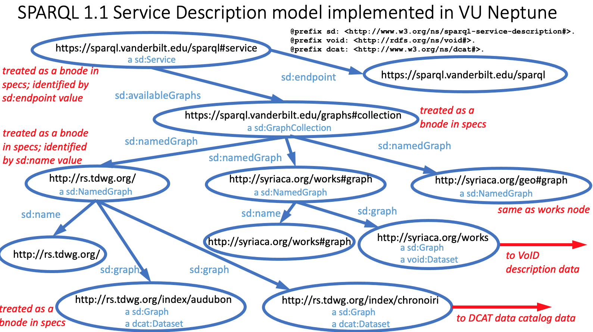
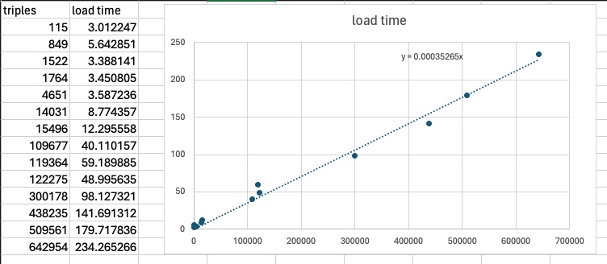
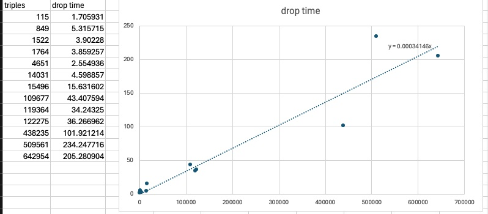

# Scripts and information for interacting with AWS Neptune

This directory contains scripts for interacting with an AWS Neptune instance. It was specifically developed for use with the Vanderbilt Neptune instance whose endpoint is at `https://sparql.vanderbilt.edu/sparql` .  

# load_neptune.py

load_neptune.py is a Python script for loading data into an AWS Neptune instance from an S3 bucket via a lambda function. It also can be used to drop named graphs from the Neptune instance.

As a management policy, no data should be loaded into the triplestore without explicitly being associated with a named graph. The software ensures this by requiring associations between the RDF data files and named graphs to be made in CSV files. By associating RDF datasets with particular named graphs, it is possible to drop and reload the data for a particular project without affecting other projects. It also ensures that conflicting data from other projects does not influence the outcome of queries, since only data from specified named graphs will be considered in a query.



## Service Description Model

In addition to simply loading triples into named graphs, the script also links the named graphs to the SPARQL Service resource through a GraphCollection instance. This provides a mechanism to query the endpoint to discover all of the named graphs in the triplestore and retrieve basic metadata about those graphs. The graph model is based on the W3C SPARQL 1.1 Service Description model and is shown in the diagram above.

The following query can be used to retrieve the named graphs and their metadata:

```
PREFIX sd:      <http://www.w3.org/ns/sparql-service-description#>
PREFIX dcterms: <http://purl.org/dc/terms/>
PREFIX dc:      <http://purl.org/dc/elements/1.1/>

SELECT DISTINCT ?NamedGraph ?modified ?issued ?publisher ?status
FROM <https://sparql.vanderbilt.edu/graphs>
WHERE {
?Service sd:endpoint <https://sparql.vanderbilt.edu/sparql>.
?Service sd:availableGraphs ?GraphCollection.
?GraphCollection sd:namedGraph ?NamedGraph.
?NamedGraph dcterms:modified ?modified.
optional {?NamedGraph dcterms:issued ?issued.}
optional {?NamedGraph dc:publisher ?publisher.}
optional {?NamedGraph <http://rs.tdwg.org/dwc/terms/attributes/status> ?status.}    
}
order by desc(?issued)
```

This query (and any other query) can be made to the `https://sparql.vanderbilt.edu/sparql` endpoint using a graphical interface at <https://sparql.replit.app/>.

NOTE: the query above will retrieve only named graphs that have been linked to the SPARQL Service resource. It is possible to have named graphs in the triplestore that are not linked to the SPARQL Service resource if they were loaded by means other than the load_neptune.py script, which automatically makes those links.

# Script details

Script location: <https://github.com/HeardLibrary/linked-data/blob/master/neptune/load_neptune.py>

Current version: v0.1.3

Date of most current version: 2024-04-12

Written by Steve Baskauf

Copyright 2024 Vanderbilt University. This program is released under a [GNU General Public License v3.0](http://www.gnu.org/licenses/gpl-3.0).

### RFC 2119 key words

The key words “MUST”, “MUST NOT”, “REQUIRED”, “SHALL”, “SHALL NOT”, “SHOULD”, “SHOULD NOT”, “RECOMMENDED”, “MAY”, and “OPTIONAL” in this document are to be interpreted as described in [BCP 14](https://www.rfc-editor.org/info/bcp14) \[[RFC 2119](https://datatracker.ietf.org/doc/html/rfc2119)\] and \[[RFC 8174](https://datatracker.ietf.org/doc/html/rfc8174)\] when, and only when, they appear in all capitals, as shown here.

## Modules required

In order to avoid the necessity of uploading custom layers, the script limits the imported modules to those that are included automatically in the AWS Lambda Python environment.

## Source data CSV files

The script receives input from some CSV files present in the S3 bucket. 

The first file, `named_graphs.csv` MUST be present for all operations except `initialize`. This file describes the metadata properties of each of the named graphs to be uploaded. The file MUST be in the root directory of the S3 data bucket. It contains a REQUIRED column `sd:name` that provides the IRI of the named graph and a REQUIRED column `load_status` that SHOULD be empty initially and is used to record the status of the load or drop operations as they are carried out. The `load_status` column makes it possible to determine what stage of the operation was in operation when the script was interrupted or timed out. All other columns are OPTIONAL and are used to provide metadata about the named graph. An [example named_graphs.csv file](named_graphs.csv) is provided in the repository.

The second file, `graph_file_associations.csv` is REQUIRED only for the `load` and `metadata` operations. It is used to associate the named graphs with the files that contain the RDF data to be loaded. If present, the file MUST be in the root directory of the S3 data bucket. It contains five REQUIRED columns. The `sd:name` column provides the IRI of the named graph. It serves as a foreign key associating rows with the primary key (`sd:name`) in the `named_graphs.csv` file. The `sd:graph` column contains an IRI distinguishing the subgraph of the named graph whose triples are contained in the RDF data file to be uploaded. The `sd:graph` IRI MUST NOT be the same as the `sd:name` IRI. If a named graph contains only a single subgraph, the two IRIs MAY be differentiated using a fragment identifier. The filename column contains the name of the file in the S3 bucket that contains the RDF data to be loaded. The `graph_load_status` column SHOULD be empty initially and is used to record the status of the load operation as it is carried out. The `graph_load_status` column makes it possible to determine what stage of the operation was in operation when the script was interrupted or timed out. The `elapsed_time` column SHOULD be empty initially and is used to record the cumulative elapsed time after each file is uploaded. An [example graph_file_associations.csv file](graph_file_associations.csv) is provided in the repository.

### Strategies for associating named graphs with files

There are two main strategies for associating named graphs with files. 

The first is to have a single file for each named graph. This is the simplest strategy and is a useful strategy if it is likely that queries will often use only part of the information from a project. It is also useful in the case where the data files are very large, since the script drops the entire named graph before loading the new data. If several large files were included in a single named graph, the drop operation would take a long time and all of the data files would need to be reloaded even if only one of them had changed. This strategy is illustrated in the syriaca.org part of the Service Description Model diagram above. The disadvantage of this strategy is that each of the named graphs must be specified in the query.

The second strategy is to have several files for each named graph, each with a distinct `sd:graph` IRI. This strategy is used in the example file and is useful if the data files are generated separately but are small. If it is likely that queries will often use the entire set of data from a project, this strategy requires specifying only a single named graph in the query. This strategy is illustrated in the rs.tdwg.org part of the Service Description Model diagram above. The disadvantage of this strategy is that all of the files must be dropped and reloaded if any of them change, although this is trivial if the files are small.

## Configuration files

There are two REQUIRED configuration files necessary for the script to run. Both must be present in a `config` subdirectory of the S3 data bucket.

The first file, [prefixes.txt](config/prefixes.txt), is a plain text file containing a list of common namespace prefixes that will be prepended to the `insert data` update that describes the named graphs. Therefore, it MUST contain all of the namespaces that are used in the column headers of the second configuration file, plus `dcterms:` and `xsd:`. An example file is in the config subdirectory of this repository.

The second file, [named_graphs_config.json](config/named_graphs_config.json), is a JSON file that maps the column headers of the `named_graphs.csv` to the RDF properties whose values are found in the columns of the CSV file. As configured by default, the file contains the following JSON. It is not necessary to modify this file unless OPTIONAL metadata is to be provided for the named graphs.

```
[
  {
    "column_header": "sd:name",
    "object_type": "iri"
  },
  {
    "column_header": "dcterms:issued",
    "object_type": "literal",
    "datatype": "xsd:date"
  },
  {
    "column_header": "dc:publisher",
    "object_type": "literal"
  },
  {
    "column_header": "rdf:type",
    "object_type": "curie"
  },
  {
    "column_header": "dcterms:isPartOf",
    "object_type": "iri"
  },
  {
    "column_header": "tdwgutility:status",
    "object_type": "literal"
  }
]
```

The value of the `column_header` key MUST be the same as the corresponding header in the `named_graphs.csv` file. Since these headers are interpreted directly as RDF properties, they must include a namespace prefix that is included in the `prefixes.txt` configuration file described above. The `object_type` key indicates the category of the value of the RDF property. It MUST be one of the following values:

- `iri` - the value is an unabbreviated IRI
- `curie` - the value is a compact URI (CURIE) using one of the namespace prefixes in the `prefixes.txt` file
- `literal` - the value is a literal. 

If the `object_type` value is `literal` and the column contains *plain literals*, no additional keys are needed. *Datatyped literals* MUST have an additional key `datatype` whose value is the curie of the datatype (again using namespace abbreviations found in the `prefixes.txt` file). *Language-tagged literals* MUST have an additional key `lang` whose value is a valid language tag.

## Initiating the script and operations options

Initiation of the lambda function containing the script is triggered by a file DROP operation on the data S3 bucket whose name is hard-coded as a global variable at the top of the script. The file that is dropped MUST be a plain text file named `trigger.txt` ([example](trigger.txt)). It MUST contain a single text string which contains the name of the operation to be performed. The file is deleted after the operation is initiated. 

The script can perform four operations identified by these strings: `initialize`, `load`, `metadata`, and `drop`. The `initialize` operation creates metadata about the SPARQL Service resource and the GraphCollection instance. It SHOULD only be done once at the initial setup of the triplestore. The `load` operation loads RDF data from files into named graphs. The `metadata` operation records the same metadata about graphs as the load operation, but without actually loading the data. It is useful in cases where graphs are loaded successfully, but the metadata is not loaded (see the "Loading time and file size" section below for situations where this might occur). The `drop` operation removes named graphs and their associated metadata from the triplestore.

| operation | required CSVs | notes |
| --------- | ---------- | ------ |
| initialize | none | used once at the initial setup of the triplestore |
| load | `named_graphs.csv` and `graph_file_associations.csv` | drops previous versions of the named graphs and loads the new data |
| metadata | `named_graphs.csv` and `graph_file_associations.csv` | loads metadata about the named graphs into the triplestore without actually loading data into the graphs |
| drop | `named_graphs.csv` | drops named graphs listed in `sd:name` column of the CSV and ignores data in any other column |

Because the data files to be loaded may be large, they can be uploaded to the S3 bucket before a `load` operation is initiated. The `load` operation triggered by dropping the `trigger.txt` file in the S3 bucket will begin almost immediately since the text file is small.

## RDF data files

The RDF data files to be loaded into the named graphs MUST be in the root directory of the S3 data bucket. The files MUST be in one of the serializations supported by Neptune. The data file MUST use the standard file extension for the serialization since Neptune determines the import format based on the file extension. The following file extensions are known to be supported by Neptune:

- .ttl - Turtle
- .nt - N-Triples
- .rdf - RDF/XML
- .jsonld - JSON-LD

**TODO: need to double-check this list**

Please note that the import process is very sensitive to serialization errors. Therefore, it is advised that you validate the RDF data files before attempting to load them into Neptune. If the upload of multiple files is disrupted by an error in one of the files, the logging data described below can be used to troubleshoot and restart the process without reloading any files that were successfully loaded. 

## Logging

The status of the operations is logged in two ways. 

For all operations, the script writes to a log file named `log.txt` that is placed in the root directory of the S3 data bucket. The log is written to the file at each stage in the operation, so that if the operation is interrupted (either through an error or by timing out), the log can be used to help determine the cause of the failure and to restart the operation at the point of failure. The log file is also useful for monitoring the progress of the operation. While in the S3 portion of the AWS Management Console, navigate to the log file and click on the `Open` button to view the log in a new tab. Once you are viewing the log tab, you can just refresh the page to see more recent log entries.

For the `load` and `drop` operations, entries are made in rows of the CSV tables that are associated with the operation. The `load_status` column of the `named_graphs.csv` file and the `graph_load_status` column of the `graph_file_associations.csv` file are used to record the status of the operations as they are carried out. These columns SHOULD be empty initially, otherwise statuses recorded in previous operations will make interpretation of the progress difficult.

**TODO: add AWS configuration information needed for the lambda to run, including the timeout value.**

# Loading time and file size

The script works well when loading a few small files. However, if many small files are loaded, or if files containing many triples are loaded, then you need to pay attention to the following details to prevent timeouts or deal with situations where Neptune completes the task but does not respond to the loader script.

## Time to load big files

The load time for files seems to depend primarily on the number of triples to be loaded.



For unknown reasons, Neptune does not respond to the client when loading files larger than about a million triples (load time about 350 s), even though it completes the load as long as its load time does not exceed the Neptune timeout setting. So it is not possible to know when the load has completed by viewing the log file, since it is updated when a response is received from the server. An alternative way to check if the graph has completed its loading is to perform a SPARQL query to list existing named graphs:

```
SELECT DISTINCT ?g 
WHERE {
  GRAPH ?g { ?s ?p ?o }
}
```

If the graph IRI is returned in the query results, then the graph has been loaded. NOTE: this presupposes that either the graph is new, or that it was successfully deleted prior to updating it with new data.

With a timeout setting of 15 minutes (900 s), Neptune should be able to load files containing up to a little fewer than 2.5 million triples. This is consistent with empirical data showing that files containing 2.35 million triples did not load, while files containing 1.62 million triples and 1.41 million triples did load. 

## Time to drop graphs

The time to drop graphs seems to be linear with the number of triples in the graph and is very similar to the load time. So it takes roughly as long to drop a graph as it does to load it.



## Practical implications of load and drop times

Because AWS Lambda functions have a maximum execution time of 15 minutes, the cumulative load times for all graphs is limited. If the graphs already exist and must first be dropped before the updated graphs are loaded, then the cumulative load time can't be longer than about 7 minutes (there is also some overtime for writing files and additional triples). If the graphs are new and no pre-existing graphs need to be dropped, then the cumulative load time can't be longer than about 14 minutes.

Any individual files containing more than about 700 000 triples should be loaded separately, since the script will not be able to proceed with loading additional files without a response from Neptune. Because a lack of response from Neptune prevents the generation of metadata about the loaded graph, after loading larger files, the script should be re-run with the same `graph_file_associations.csv` and `named_graphs.csv` files using the `metadata` command to generate the metadata triples. 

Files larger than about 700 000 triples that are replacing previously loaded graphs must be dropped as a separate operation prior to loading the new graphs, since the drop time is too long to get a response from Neptune and the script will not be able to proceed with loading the new file. Performing a drop-only operation can be done using the `drop` command.

If extremely large datasets should be loaded with caution. If the triples are serialized in n-triples or n-quads format, the input file can be broken up into several smaller files relatively easily since each triple is on a separate line in the file. Each separate file could then be loaded into the same named graph. This is not currently supported in the script since graphs are dropped prior to loading new data into the graph. However, the script could be hacked to suppress dropping. However, keep in mind that dropping a graph takes as long as loading a graph, so the time to drop the graph would roughly be the sum of the load times of all of the individual files. Thus it would be possible to create a very large graph whose drop time exceeds the timeout time for Neptune, i.e. creating a graph in multiple loads that is too large to drop without increasing the timeout value.

# Debugging

It is very difficult to determine the cause of errors when the Lambda is running after being triggered by the bucket drop. An alternative method is to hack the script to ignore the `trigger.txt` file and just launch the Lambda using the `test` button in the web interface. To do this:

1. Comment out [the lines that read from and delete the `trigger.txt` file](https://github.com/HeardLibrary/linked-data/blob/984e67d1634a6da2e122db5b9e583f02df904ceb/neptune/load_neptune.py#L474:L480).
2. Add a line that hard codes the value for `trigger_text` to initiate the operation you desire. For example, to do the load operation, add this line after the lines you commented out:

```
trigger_text = 'load'
```

# Development notes

I learned several important things about the AWS Lambda environment while developing this script. 

1. The timeout needs to be increased to a long enough time that the script can finish. The default 3 seconds cause the script to time out and throw errors that weren't actually errors -- the timeout setting just wasn't long enough. I wasted a lot of time trying to debug when there actually was nothing wrong with the code.
2. I used the `typing` module to define the types of the function arguments and return values. AWS Lambda enforces the declared types very strictly. So for example, if an argument is an ordered dictionary and you declare the type to be Dict, the script will fail because the types don't match. This is way more strict than the normal Python environment that you run from the command line on your computer or a Jupyter notebook. So I did stuff like just declare `List` rather than `List[Dict]` if the list contained objects that weren't vanilla dictionaries.
3. This may seem obvious, but permissions need to be set for S3 access or the Lambda can't read from the S3 bucket, even if it is set to be Public.
4. Once the Lambda is assigned to the a VPC (i.e. the same one as Neptune), it can't access the Internet. So testing that I was doing by using HTTP GET to acquire data for testing stopped working as soon as the Lambda was in the VPC. 

----
Last modified: 2024-04-15